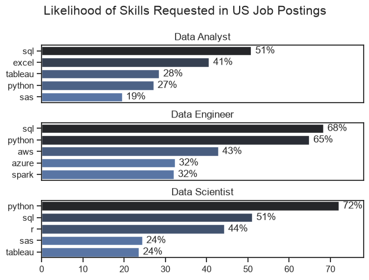
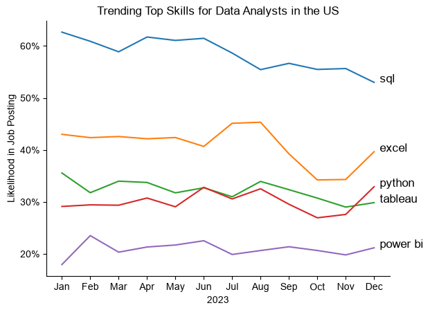
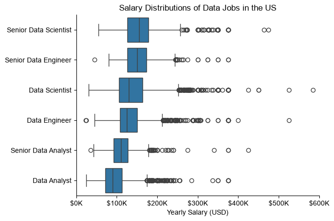
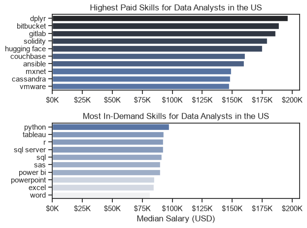
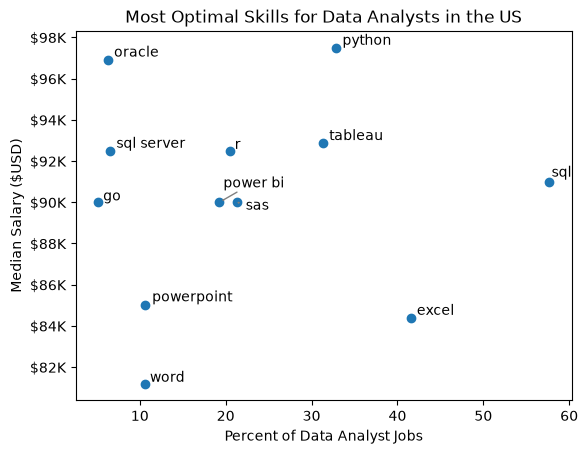
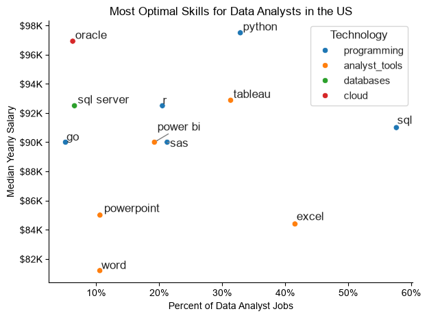

# Overview

Welcome to my analysis of the data job market, focusing on data analyst roles. This project was created out of a desire to navigate and understand the job market more effectively. It delves into the top-paying and in-demand skills to help find optimal job opportunities for data analysts.

The data sourced from [Luke Barousse's Python Course](https://lukebarousse.com/python) which provides a foundation for my analysis, containing detailed information on job titles, salaries, locations, and essential skills. Through a series of Python scripts, I explore key questions such as the most demanded skills, salary trends, and the intersection of demand and salary in data analytics.

# The Questions

Below are the questions I want to answer in my project:

1. What are the skills most in demand for the top 3 most popular data roles?
2. How are in-demand skills trending for Data Analysts?
3. How well do jobs and skills pay for Data Analysts?
4. What are the optimal skills for data analysts to learn? (High Demand AND High Paying) 

# Tools I Used

For my deep dive into the data analyst job market, I harnessed the power of several key tools:

- **Python:** The backbone of my analysis, allowing me to analyze the data and find critical insights.I also used the following Python libraries:
    - **Pandas Library:** This was used to analyze the data. 
    - **Matplotlib Library:** I visualized the data.
    - **Seaborn Library:** Helped me create more advanced visuals. 
- **Jupyter Notebooks:** The tool I used to run my Python scripts which let me easily include my notes and analysis.
- **Visual Studio Code:** My go-to for executing my Python scripts.
- **Git & GitHub:** Essential for version control and sharing my Python code and analysis, ensuring collaboration and project tracking.

# Data Preparation and Cleanup

This section outlines the steps taken to prepare the data for analysis, ensuring accuracy and usability.

## Import & Clean Up Data

I start by importing necessary libraries and loading the dataset, followed by initial data cleaning tasks to ensure data quality.

```python
# Importing Libraries
import ast
import pandas as pd
import seaborn as sns
from datasets import load_dataset
import matplotlib.pyplot as plt  

# Loading Data
dataset = load_dataset('lukebarousse/data_jobs')
df = dataset['train'].to_pandas()

# Data Cleanup
df['job_posted_date'] = pd.to_datetime(df['job_posted_date'])
df['job_skills'] = df['job_skills'].apply(lambda x: ast.literal_eval(x) if pd.notna(x) else x)
```

## Filter US Jobs

To focus my analysis on the U.S. job market, I apply filters to the dataset, narrowing down to roles based in the United States.

```python
df_US = df[df['job_country'] == 'United States']

```

# The Analysis

Each Jupyter notebook for this project aimed at investigating specific aspects of the data job market. Here’s how I approached each question:

## 1. What are the most demanded skills for the top 3 most popular data roles?

To find the most demanded skills for the top 3 most popular data roles. I filtered out those positions by which ones were the most popular, and got the top 5 skills for these top 3 roles. This query highlights the most popular job titles and their top skills, showing which skills I should pay attention to depending on the role I'm targeting. 

View my notebook with detailed steps here: [2_Skill_Count](02_skills_count.ipynb).

### Visualize Data

```python
fig, ax = plt.subplots(len(job_titles), 1)


fig, ax = plt.subplots(len(job_titles), 1)


for i, job_title in enumerate(job_titles):
    df_plot = df_skills_perc[df_skills_perc['job_title_short'] == job_title].head(5)
    sns.barplot(data=df_plot, x='skill_percent', y='job_skills', ax=ax[i], hue='skill_count', palette='dark:b_r')
    ax[i].set_title(job_title)
    ax[i].set_ylabel('')
    ax[i].set_xlabel('')
    ax[i].get_legend().remove()
    ax[i].set_xlim(0, 78)
    # remove the x-axis tick labels for better readability
    if i != len(job_titles) - 1:
        ax[i].set_xticks([])

    # label the percentage on the bars
    for n, v in enumerate(df_plot['skill_percent']):
        ax[i].text(v + 1, n, f'{v:.0f}%', va='center')

fig.suptitle('Likelihood of Skills Requested in US Job Postings', fontsize=15)
fig.tight_layout(h_pad=.8)
plt.show()
```

### Results



*Bar graph visualizing the salary for the top 3 data roles and their top 5 skills associated with each.*

### Insights:

- SQL is the most requested skill for Data Analysts and Data Engineers, with it in over half the job postings for both roles. For Data Scientist, Python is the most sought-after skill, appearing in 72% of job postings.
- Data Engineers require more specialised technical skills (AWS, Azure, Spark) compared to Data Analysts and Data Scientists who are expected to be proficient in more general data management and analysis tools (Excel, Tableau).
- Python is a versatile skill, highly demanded across all three roles, but most prominently for Data Scientists (72%) and Data Engineers (65%).

## 2. How are in-demand skills trending for Data Analysts?

To find how skills are trending in 2023 for Data Analysts, I filtered data analyst positions and grouped the skills by the month of the job postings. This got me the top 5 skills of data analysts by month, showing how popular skills were throughout 2023.

View my notebook with detailed steps here: [3_Skills_Trend](03_skills_trend.ipynb).

### Managing Data 

```python
# sorting values
df_DA_US_pivot.loc['Total'] = df_DA_US_pivot.sum()
df_DA_US_pivot = df_DA_US_pivot[df_DA_US_pivot.loc['Total'].sort_values(ascending=False).index]
df_DA_US_pivot = df_DA_US_pivot.drop('Total')

DA_totals = df_DA_US.groupby('job_posted_month_no').size()
df_DA_US_percent = df_DA_US_pivot.div(DA_totals/100, axis=0)

# changes month number to month name
df_DA_US_percent = df_DA_US_percent.reset_index()
df_DA_US_percent['job_posted_month'] = df_DA_US_percent['job_posted_month_no'].apply(lambda x: pd.to_datetime(x, format='%m').strftime('%b'))
df_DA_US_percent = df_DA_US_percent.set_index('job_posted_month')
df_DA_US_percent = df_DA_US_percent.drop(columns='job_posted_month_no')

```


### Visualize Data

```python

from matplotlib.ticker import PercentFormatter

df_plot = df_DA_US_percent.iloc[:, :5]
sns.lineplot(data=df_plot, dashes=False, legend='full', palette='tab10')
sns.set_theme(style='ticks')
sns.despine() 

plt.title('Trending Top Skills for Data Analysts in the US')
plt.ylabel('Likelihood in Job Posting')
plt.xlabel('2023')
plt.legend().remove()
plt.gca().yaxis.set_major_formatter(PercentFormatter(decimals=0))

# annotate the plot with the top 5 skills using plt.text()
for i in range(5):
    plt.text(11.2, df_plot.iloc[-1, i], df_plot.columns[i], color='black')

plt.show()

```

### Results

 
*Bar graph visualizing the trending top skills for data analysts in the US in 2023.*

### Insights:
- SQL remains the most consistently demanded skill throughout the year, although it shows a gradual decrease in demand.
- Excel experienced a significant drop in demand starting around August, yet surpassing both Python and Tableau by the end of the year.
- Both Python and Tableau show relatively stable demand throughout the year with some fluctuations but remain essential skills for data analysts. Power BI, while less demanded compared to the others, shows a slight upward trend towards the year's end.

## 3. How well do jobs and skills pay for Data Analysts?

To identify the highest-paying roles and skills, I only got jobs in the United States and looked at their median salary. But first I looked at the salary distributions of common data jobs like Data Scientist, Data Engineer, and Data Analyst, to get an idea of which jobs are paid the most. 

View my notebook with detailed steps here: [4_Salary_Analysis](04_salary_analysis.ipynb).

#### Visualize Data 

```python
sns.boxplot(data=df_US_top6, x='salary_year_avg', y='job_title_short', order=job_order)
sns.set_theme(style='ticks')
sns.despine()

plt.title('Salary Distributions of Data Jobs in the US')
plt.xlabel('Yearly Salary (USD)')
plt.ylabel('')
plt.xlim(0, 600000) 
ticks_x = plt.FuncFormatter(lambda y, pos: f'${int(y/1000)}K')
plt.gca().xaxis.set_major_formatter(ticks_x)
plt.show()

```

#### Results

 
*Box plot visualizing the salary distributions for the top 6 data job titles.*

#### Insights

- The median salaries increase with the seniority and specialization of the roles. Senior roles (Senior Data Scientist, Senior Data Engineer) not only have higher median salaries but also larger differences in typical salaries, reflecting greater variance in compensation as responsibilities increase.

- There's a significant variation in salary ranges across different job titles. Data Scientist positions tend to have the highest salary potential, with up to $600K, indicating the high value placed on advanced data skills and experience in the industry.

- Data Engineer and Data Scientist roles show a considerable number of outliers on the higher end of the salary spectrum, suggesting that exceptional skills or circumstances can lead to high pay in these roles. In contrast, Data Analyst roles demonstrate more consistency in salary, with fewer outliers.


### Highest Paid & Most Demanded Skills for Data Analysts

Next, I narrowed my analysis and focused only on data analyst roles. I looked at the highest-paid skills and the most in-demand skills. I used two bar charts to showcase these.

#### Visualize Data

```python

fig, ax = plt.subplots(2, 1)  

# Top 10 Highest Paid Skills for Data Analysts
sns.barplot(data=df_DA_top_pay, x='median', y=df_DA_top_pay.index, hue='median', ax=ax[0], palette='dark:b_r')

# Top 10 Most In-Demand Skills for Data Analystsr')
sns.barplot(data=df_DA_skills, x='median', y=df_DA_skills.index, hue='median', ax=ax[1], palette='light:b')

sns.set_theme(style='ticks')
plt.tight_layout()
plt.show()

```

#### Results
Here's the breakdown of the highest-paid & most in-demand skills for data analysts in the US:


*Two separate bar graphs visualizing the highest paid skills and most in-demand skills for data analysts in the US.*

#### Insights:

- The top graph shows specialized technical skills like `dplyr`, `Bitbucket`, and `Gitlab` are associated with higher salaries, some reaching up to $200K, suggesting that advanced technical proficiency can increase earning potential.

- The bottom graph highlights that foundational skills like `Excel`, `PowerPoint`, and `SQL` are the most in-demand, even though they may not offer the highest salaries. This demonstrates the importance of these core skills for employability in data analysis roles.

- There's a clear distinction between the skills that are highest paid and those that are most in-demand. Data analysts aiming to maximize their career potential should consider developing a diverse skill set that includes both high-paying specialized skills and widely demanded foundational skills.

## 4. What are the most optimal skills to learn for Data Analysts?
To identify the most optimal skills to learn ( the ones that are the highest paid and highest in demand) I calculated the percent of skill demand and the median salary of these skills. To easily identify which are the most optimal skills to learn. 

View my notebook with detailed steps here: [5_Optimal_Skills](05_optimal_skills.ipynb).

#### Visualize Data

```python
from adjustText import adjust_text

plt.scatter(df_DA_skills_high_demand['skill_percent'], df_DA_skills_high_demand['median_salary'])
plt.xlabel('Percent of Data Analyst Jobs')
plt.ylabel('Median Salary ($USD)')  # Assuming this is the label you want for y-axis
plt.title('Most Optimal Skills for Data Analysts in the US')

# Get current axes, set limits, and format axes
ax = plt.gca()
ax.yaxis.set_major_formatter(plt.FuncFormatter(lambda y, pos: f'${int(y/1000)}K'))  # Example formatting y-axis

# Add labels to points and collect them in a list
texts = []
for i, txt in enumerate(df_DA_skills_high_demand.index):
    texts.append(plt.text(df_DA_skills_high_demand['skill_percent'].iloc[i], df_DA_skills_high_demand['median_salary'].iloc[i], " " + txt))

# Adjust text to avoid overlap and add arrows
adjust_text(texts, arrowprops=dict(arrowstyle='->', color='gray'))

plt.show()

```

#### Results

    
*A scatter plot visualizing the most optimal skills (high paying & high demand) for data analysts in the US.*

#### Insights:

- The skill `Python` appears to have the highest median salary of nearly $98K. Alongside its popularity, this suggests a high value placed on `Python` within the data analyst profession.

- More commonly required skills like `Excel` and `SQL` have a large presence in job listings but lower median salaries compared to specialized skills like `Python` and `Tableau`, which not only have higher salaries but are also moderately prevalent in job listings.

- Skills such as `Python`, `Tableau`, and `SQL` are towards the higher end of the salary spectrum while also being fairly common in job listings, indicating that proficiency in these tools can lead to good opportunities in data analytics.

### Visualizing Different Techonologies

Let's visualize the different technologies as well in the graph. We'll add color labels based on the technology (e.g., {Programming: Python})

#### Managing Data
```python
df_technology = df['job_type_skills'].copy()

# remove duplicates
df_technology = df_technology.drop_duplicates()

# remove NaN values
df_technology = df_technology.dropna()

# combine all dictionaries into one
technology_dict = {}
for row in df_technology:
    row_dict = ast.literal_eval(row)  # convert string to dictionary
    for key, value in row_dict.items():
        if key in technology_dict:  # if key already exists in technology_dict, add value to existing value
            technology_dict[key] += value
        else:                       # if key does not exist in technology_dict, add key and value
            technology_dict[key] = value

# remove duplicates by converting values to set then back to list
for key, value in technology_dict.items():
    technology_dict[key] = list(set(value))
```

#### Visualize Data

```python
sns.scatterplot(
    data=df_DA_skills_tech_high_demand,
    x='skill_percent',
    y='median_salary',
    hue='technology'
)

sns.despine()
sns.set_theme(style='ticks')

# Prepare texts for adjustText
texts = []
for i, txt in enumerate(df_DA_skills_high_demand.index):
    texts.append(plt.text(df_DA_skills_high_demand['skill_percent'].iloc[i], df_DA_skills_high_demand['median_salary'].iloc[i], txt))

# Adjust text to avoid overlap
adjust_text(texts, arrowprops=dict(arrowstyle='->', color='gray'))

# Set axis labels, title, and legend
plt.xlabel('Percent of Data Analyst Jobs')
plt.ylabel('Median Yearly Salary')
plt.title('Most Optimal Skills for Data Analysts in the US')
plt.legend(title='Technology')

from matplotlib.ticker import PercentFormatter
ax = plt.gca()
ax.yaxis.set_major_formatter(plt.FuncFormatter(lambda y, pos: f'${int(y/1000)}K'))
ax.xaxis.set_major_formatter(PercentFormatter(decimals=0))

# Adjust layout and display plot 
plt.tight_layout()
plt.show()


```

#### Results

  
*A scatter plot visualizing the most optimal skills (high paying & high demand) for data analysts in the US with color labels for technology.*

#### Insights:

- The scatter plot shows that most of the `programming` skills (colored blue) tend to cluster at higher salary levels compared to other categories, indicating that programming expertise might offer greater salary benefits within the data analytics field.

- The database skills and cloud skills, i.e. Oracle and SQL server, are associated with some of the highest salaries among data analyst tools. This indicates a significant valuation for data management and manipulation expertise in the industry.

- Analyst tools (colored orange), including Tableau and Power BI, are prevalent in job postings and offer competitive salaries, showing that visualization and data analysis software are crucial for current data roles. This category not only has good salaries but is also versatile across different types of data tasks.

# What I Learned

Throughout this project, I deepened my understanding of the data analyst job market and enhanced my technical skills in Python, especially in data manipulation and visualization. Here are a few specific things I learned:

- **Advanced Python Usage**: I developed greater confidence in using Python to manipulate, filter, transform, and analyse large datasets, while learning how different functions and techniques can streamline the analytical process.

- **Data Cleaning Importance**: I learned that real-world datasets often contain missing values, duplicates, and inconsistent formats, making data cleaning an essential step for producing reliable and meaningful results.

- **Strategic Skill Analysis**: The project showed me how analysing both the demand and salary associated with different skills can provide a clearer picture of the job market and help identify areas for further professional development.

# Insights

This project provided several general insights into the data job market for analysts:

- **Technical Skill Priorities**: The analysis shows that certain technical skills consistently appear across data analyst job postings, suggesting that building a strong foundation in widely used tools can improve employability.

- **Salary Differences Across Skills**: Salary levels vary considerably between skills, indicating that some specialised technologies may offer greater earning potential than more general skills.

- **Importance of Practical Skills**: The findings suggest that employers value a combination of programming, database, and analytical skills rather than relying on a single technical skill.

- **Changing Technology Landscape**: The variation in skill demand over time demonstrates that the data analytics field continues to evolve, making continuous skill development important for staying competitive.

- **Skills as a Career Strategy**: Comparing both skill frequency and associated salaries provides a useful framework for identifying skills that may offer a balance between market demand and potential career opportunities.

# Challenges I Faced

This project was not without its challenges, but it provided good learning opportunities:

- **Data Transformation**: Converting raw and unstructured data into a consistent format required careful use of data manipulation techniques to make the dataset suitable for analysis.

- **Managing Large Datasets**: Working with a large number of job postings presented challenges in terms of processing speed and efficiently handling data without affecting the quality of the analysis.

- **Selecting Appropriate Methods**: Choosing suitable statistical methods, aggregation techniques, and visualisations for different analytical questions required careful consideration to ensure the results were meaningful.

- **Interpreting Results**: Translating numerical findings and visual patterns into clear, practical insights required careful interpretation while avoiding unsupported conclusions.

- **Organising the Analysis**: Structuring multiple stages of data cleaning, analysis, and visualisation into a coherent workflow was challenging but important for keeping the project clear and reproducible.


# Conclusion

This project provided valuable insights into the current data analyst job market, particularly in terms of the skills, salaries, and employment trends associated with the field. Through the process of cleaning, analysing, and visualising the data, I developed a better understanding of how different technical skills and job characteristics relate to opportunities in data analytics. The project also strengthened my practical skills in Python, Pandas, Matplotlib, and data visualisation. Overall, this analysis has provided a strong foundation for further exploration of the data job market and highlighted the importance of developing relevant technical skills in an increasingly data-driven workplace.
